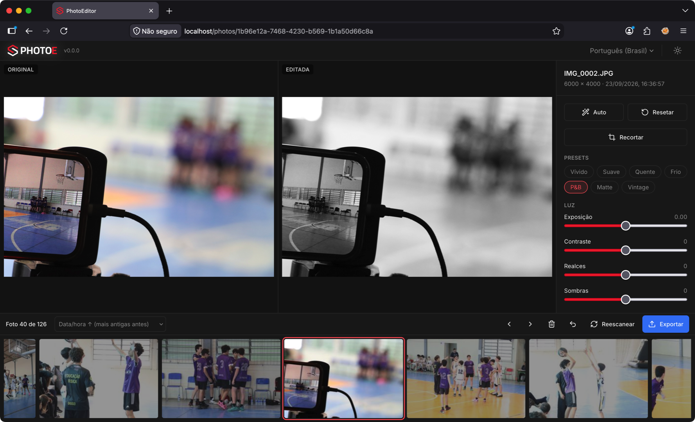
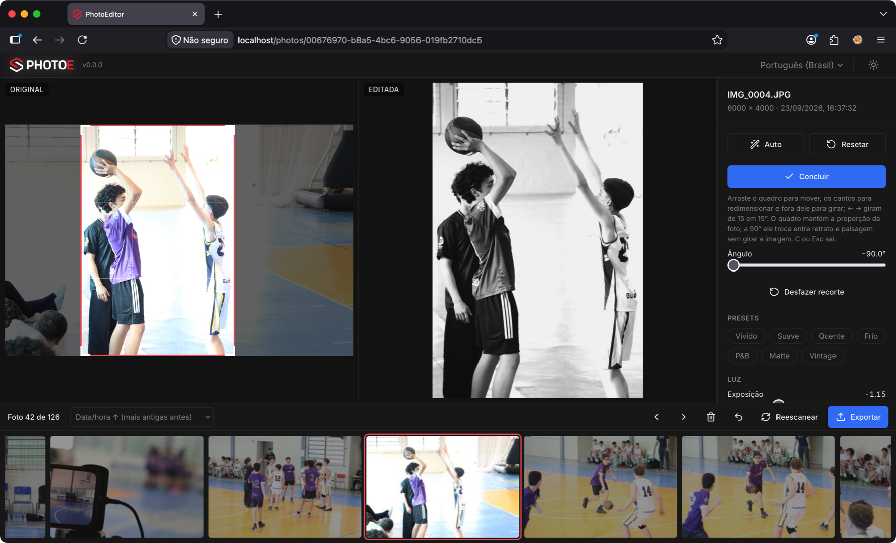
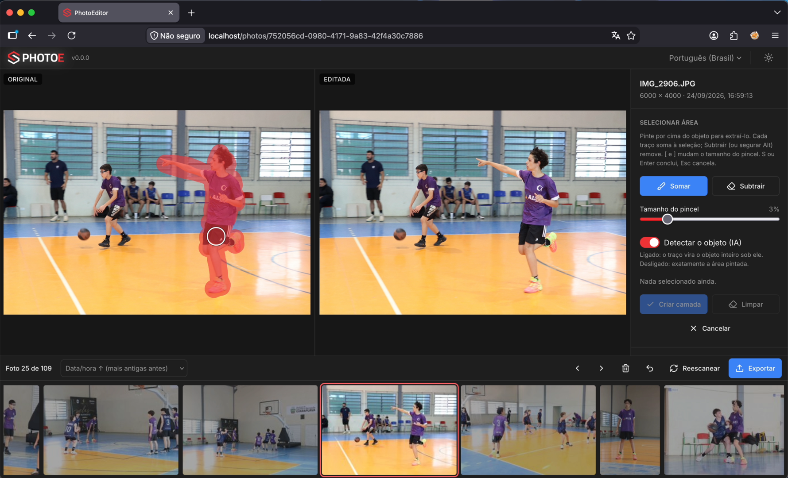
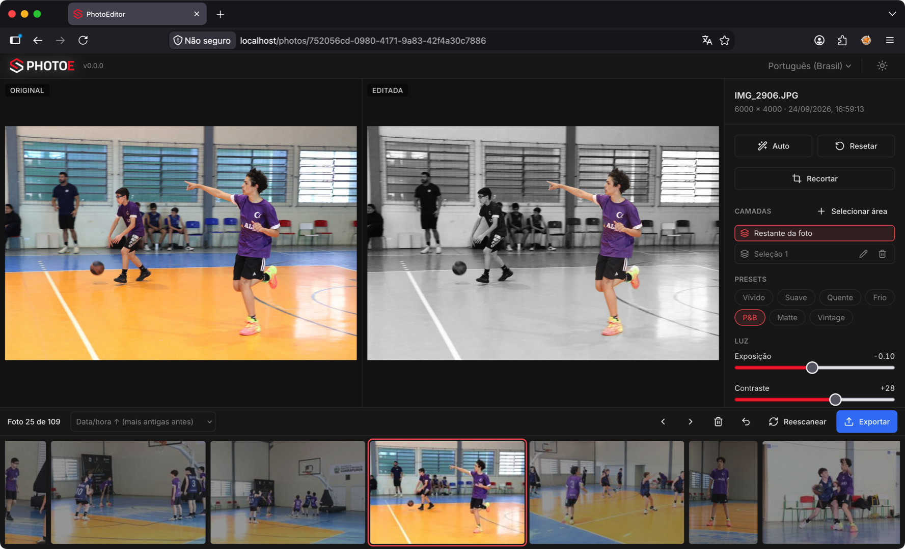

# PhotoEditor

**PhotoEditor é um sistema livre ([BSD 2-Clause](./LICENSE)), feito para
otimizar a seleção e a edição rápida de fotos de eventos.** Em vez de abrir
centenas de arquivos um a um, você percorre o evento inteiro pelo teclado:
descarta as fotos ruins com `DEL`,
aplica `A` (Auto) ou um preset, recorta com `C`, extrai uma pessoa ou objeto
numa camada com `S` e exporta tudo de uma vez, já no formato de publicação. A edição nunca altera os originais.

Foi criado por **Helvio Junior** para agilizar o fluxo das coberturas
fotográficas do [PhotoE](https://photoe.com.br/) — da triagem logo depois do
evento até a pasta pronta para publicar.

Editor no estilo Lightroom (Django REST + React), rodando localmente em Docker
sobre a pasta de fotos do evento.

O sistema é **100% público e não autenticado**: não há login, contas, empresas
nem permissionamento. O Django admin também é aberto — quem acessa `/admin/`
entra automaticamente como o usuário padrão `admin`, que não tem senha.

> As convenções obrigatórias do projeto estão em [`CLAUDE.md`](./CLAUDE.md).
> Toda variável, valor padrão e identificador de código é escrito em **inglês**.

## Exemplos

Original e editada lado a lado, painel de edição à direita (Auto, presets e
ajustes de luz e cor) e a filmstrip do evento embaixo:



Modo recorte: o quadro fica sobre a original e a editada mostra o resultado ao
vivo — aqui girado a -90°, trocando paisagem por retrato sem girar a imagem:



## Camadas (seleção de objetos)

`S` entra no modo seleção: pinte por cima de uma pessoa ou objeto na
original e ele vira uma **camada**, com ajustes próprios — o resto da foto
fica em outra, com os dela (ex.: fundo escuro e P&B, jogador em cor). Cada
traço soma à seleção; **Subtrair** (ou `Alt`) remove; `[` e `]` diminuem e
aumentam o pincel. `L` passa de uma camada
para a outra; sliders, presets e Auto editam a camada ativa.

Seleção: o traço do pincel (em vermelho, sobre a original) cobre o jogador e
a IA estende a seleção ao objeto inteiro sob ele:



Resultado: o jogador virou a camada **Seleção 1** e mantém a cor, enquanto o
**Restante da foto** recebeu o preset P&B — o objeto é editado separado do
fundo:



Quem acha o objeto sob o traço é o **SAM 2.1 tiny** (Segment Anything 2, Meta,
Apache-2.0) em ONNX, rodando **localmente em CPU** — não precisa de GPU, de
Ollama nem de internet. O modelo (~155 MB) é baixado no build da imagem do
backend, com revisão e hashes fixos. Custo: ~1,5 s na primeira seleção de
cada foto e ~0,3 s por traço; pico de ~1,2 GB de RAM durante a análise.
Com a opção **Detectar o objeto (IA)** desligada, o pincel seleciona
exatamente a área pintada.

As máscaras ficam em `project_data/masks/` (PNG, nome = hash do conteúdo) e
entram no histórico, no desfazer e na exportação como qualquer ajuste.

## Stack

| Camada    | Tecnologia                                             |
|-----------|--------------------------------------------------------|
| Backend   | Django 5.2 + Django REST Framework, uWSGI              |
| Frontend  | React 19 (CRA/craco), TailwindCSS, react-router        |
| Banco     | SQLite na pasta do projeto (`/project/project_data`)   |
| Proxy/TLS | nginx (nginx-extras) com certificado self-signed       |

Estrutura:

```
backend/    core/ (settings, wsgi/asgi) + photoeditor/ (app: models, views, services)
frontend/   src/ (pages, components/ui, contexts, i18n, lib)
nginx/      Dockerfile + nginx.conf + entrypoint (TLS, FORCE_TLS, real_ip)
docker-compose.yml       # produção (backend + nginx)
docker-compose.dev.yml   # desenvolvimento (backend + frontend hot-reload)
.env.example             # template do .env ÚNICO (nunca versione o .env real)
```

## Principais pontos

### 1. Acesso público
- A API não tem classe de autenticação e libera tudo por padrão
  (`REST_FRAMEWORK` em `core/settings.py`).
- Django admin público: `photoeditor/middleware.py` (`PublicAdminMiddleware`)
  loga toda visita a `/admin/` como o usuário `admin` (senha inutilizável). O
  usuário é criado no boot (`startup.py:ensure_admin_user`) ou na primeira visita.
- Os estáticos do admin saem por `/django-static/` (o `/static/` é do React),
  servidos pelo `dj_static.Cling` no `core/wsgi.py` e repassados pelo nginx.

### 2. Internacionalização (EN + PT-BR)
- **EN é o padrão e o fallback** de toda tradução.
- Frontend: `useI18n()` (`t`/`tf`) + catálogos em `src/i18n/locales.js`.
- Backend: `photoeditor/i18n.py` (`translate`, `tr`, `language_for_request`).
- Idioma: cookie `photoeditor_ln` → navegador → padrão do sistema
  (`/api/config/`). O cookie é escrito pelo frontend ao trocar o idioma.

### 3. E-mail e identidade visual
- Template HTML de marca em `photoeditor/templates/email/`, renderizado por
  `services/mailer.py`.
- Logo do PhotoE no próprio build (`frontend/public/assets/logo/`, versões
  clara e escura); favicon servido de `media.sec4us.com.br`. Cache-busting
  `?ts=<BUILD_TS>` em todo objeto estático (a cada build).
- Marca configurável por env (`BRAND_*` / `REACT_APP_BRAND_*`).

### 4. UI/UX (convenções)
- Confirmações/alertas via **modais próprios** (nunca diálogos nativos do browser).
- Telas e formulários ocupam **100%** da largura.
- Detalhe de objeto abre em **janela/rota própria**, não em modal.

### 5. Infra / nginx
- Portas publicáveis via `HTTP_PORT`/`HTTPS_PORT`.
- `FORCE_TLS` (redirect HTTP→HTTPS + HSTS) respeitando `X-Forwarded-Proto` de
  proxy upstream (links saem em https mesmo recebendo na porta 80).
- `USE_REAL_IP` + `real_ip` (`set_real_ip_from`, header `SC-Connecting-IP`).

### 6. Configuração
- **Um único `.env` na raiz**, consumido pelos compose e pelo backend. Nunca
  versione o `.env` — só o `.env.example`.
- `DEBUG=False` por padrão; `PROJECT_DIR` obrigatória (pasta do projeto de fotos).

## Pasta do projeto

Cada evento é uma pasta no host, apontada por `PROJECT_DIR` no `.env` e
montada em `/project` no backend:

```
<PROJECT_DIR>/
    raw/            fotos originais (somente JPEG, nunca alteradas)
    project_data/   db.sqlite3 + caches gerados + masks/ (camadas)
    deleted/        fotos excluídas (movidas, nunca apagadas)
    publicar/       saída do botão Exportar
```

O backend cria `project_data/`, `deleted/` e `publicar/`; a `raw/` com as
fotos é sua. A cada boot ele roda `makemigrations` + `migrate` no SQLite.

## Como rodar

Pré-requisitos: Docker + Docker Compose.

```bash
cp .env.example .env          # ajuste PROJECT_DIR (pasta com raw/), portas, etc.
docker compose build
docker compose up -d
```

- App: `https://localhost` (ou a `HTTPS_PORT` configurada; certificado self-signed).
- Admin: `https://localhost/admin/` — entra direto como `admin`, sem senha.

Desenvolvimento (frontend com hot-reload em `:3000`, backend em `:8000`):

```bash
docker compose -f docker-compose.dev.yml up
```

## Banco e migrations

- Modelos em `photoeditor/dbmodels/` (herdam de `dbmodels.base.Base`); o único
  usuário é o `admin` no `auth.User` do Django.
- Migrations incrementais e versionadas (regra 13 do `CLAUDE.md`).

## Principais endpoints (API)

| Método/Rota          | Descrição                                          |
|----------------------|----------------------------------------------------|
| `GET  /api/config/`  | Idioma padrão, idiomas suportados, marca e versão  |
| `GET  /api/develop/` | Sliders, presets e camadas (`smart_select`)        |
| `POST /api/photos/<id>/segment/` | Traço do pincel → máscara do objeto    |
| `GET  /api/masks/<chave>.png` | Máscara de uma camada (overlay)           |
| `/admin/`            | Django admin público                               |

## Licença

Distribuído sob a licença **BSD 2-Clause** — veja [`LICENSE`](./LICENSE).
Criado por Helvio Junior para as coberturas do [PhotoE](https://photoe.com.br/).
