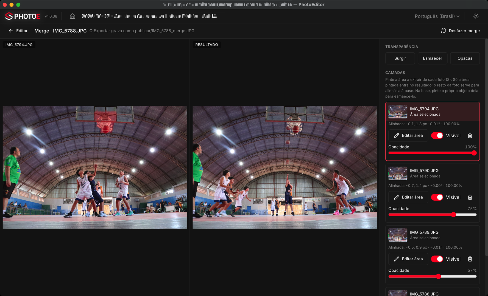
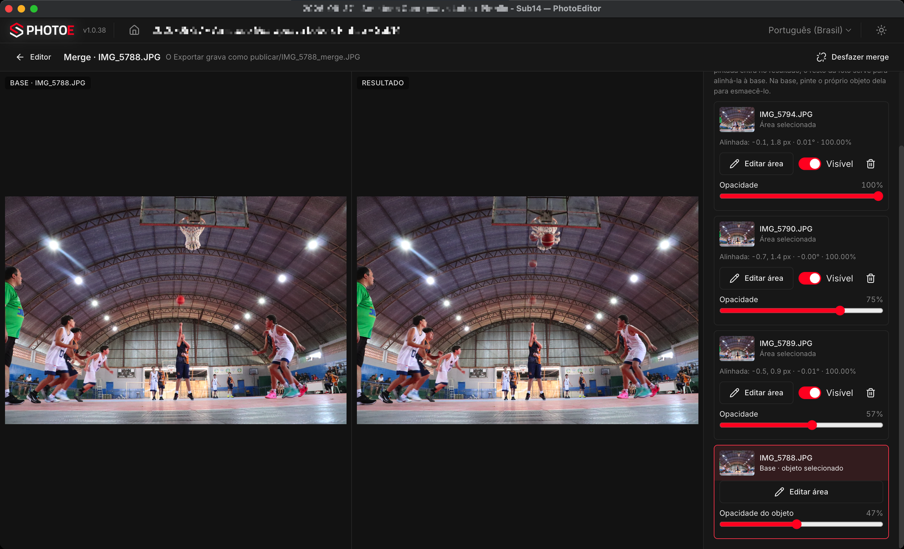
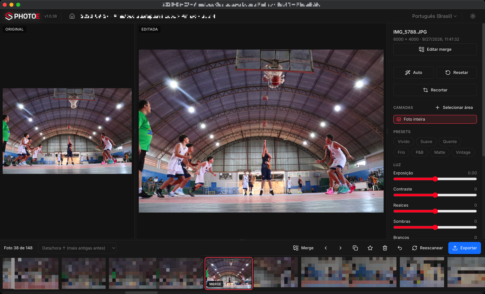

# PhotoEditor

**PhotoEditor é um sistema livre ([BSD 2-Clause](./LICENSE)), feito para
otimizar a seleção e a edição rápida de fotos de eventos.** Em vez de abrir
centenas de arquivos um a um, você percorre o evento inteiro pelo teclado:
descarta as fotos ruins com `DEL`,
aplica `A` (Auto) ou um preset, recorta com `C`, extrai uma pessoa ou objeto
numa camada com `S` e exporta tudo de uma vez, já no formato de publicação. A edição nunca altera os originais.

Foi criado por **Helvio Junior** para agilizar o fluxo das coberturas
fotográficas do [PhotoE](https://photoe.com.br/) — da triagem logo depois do
evento até a pasta pronta para publicar.

Funciona como um **aplicativo normal** no Windows, no macOS e no Linux: é
só instalar e abrir — não precisa de internet, de navegador nem de conta.
Tudo roda no seu computador, e as fotos nunca saem da pasta do evento.

## Instalação

Baixe o instalador do seu sistema na página de
[**Releases**](https://github.com/helviojunior/photo-editor/releases) (a versão
mais recente fica no topo):

| Sistema | Arquivo | Como instalar |
|---|---|---|
| macOS (Apple Silicon — M1 ou mais novo) | `PhotoEditor-<versão>-macos-arm64.dmg` | abra o `.dmg` e arraste o **PhotoEditor** para **Aplicativos** |
| macOS (Intel) | `PhotoEditor-<versão>-macos-x64.dmg` | idem |
| Windows 10/11 (inclusive em ARM) | `PhotoEditor-<versão>-windows-x64.msi` | abra o `.msi`; o atalho aparece no Menu Iniciar e na Área de Trabalho |
| Linux x64 / arm64 | `PhotoEditor-<versão>-linux-*.tar.gz` | descompacte e rode `PhotoEditor` |

Requisitos mínimos: macOS 14, Windows 10/11 64 bits, ou Linux com glibc 2.34
(Ubuntu 22.04; em arm64, Ubuntu 24.04).

> **Primeira abertura:** os instaladores ainda não são assinados.
> No **macOS**, se aparecer "não foi possível verificar o desenvolvedor", vá em
> Ajustes do Sistema → Privacidade e Segurança → **Abrir Mesmo Assim**. No
> **Windows**, na tela do SmartScreen, clique em **Mais informações** →
> **Executar assim mesmo**. A primeira abertura também é mais lenta: o sistema
> verifica o app uma vez.

Para atualizar, instale a versão nova por cima — projetos e preferências são
mantidos.

## Primeiros passos

A tela inicial mostra **Abrir projeto**, **Novo projeto** e os projetos
recentes em cards — com a capa, o número de fotos, o tamanho e a data da
última abertura.

Um **projeto** é a pasta de um evento:

```
<pasta do evento>/
    raw/            as fotos originais (JPEG) — o editor nunca as altera
    publicar/       as fotos prontas, geradas pelo botão Exportar
      instagram/    as versões Instagram (1080 px, no formato do feed)
    deleted/        as fotos excluídas (movidas para cá, nunca apagadas)
    project_data/   o catálogo e os ajustes do evento (não mexa)
```

- **Novo projeto:** escolha a pasta do evento. Se ela tiver fotos JPEG soltas,
  o app cria a `raw/` e **move** as fotos para dentro; se já for um projeto,
  só o abre; se estiver vazia, oferece copiar as fotos de outro lugar.
- **Abrir projeto:** escolha uma pasta que já tenha a `raw/` (ou clique num
  card dos recentes). Remover um card da lista nunca apaga a pasta.
- O botão **Início** (a casinha no topo) volta para a tela inicial.

## Atalhos

| Tecla | Ação |
|---|---|
| `←` `→` | foto anterior / próxima |
| `Del` | exclui a foto (vai para `deleted/`) |
| `A` | Auto |
| `C` | modo recorte |
| `S` | modo seleção (camadas); `S` de novo conclui |
| `L` | próxima camada |
| `I` | versão Instagram da foto (cria/abre); na versão, volta à foto |
| `[` `]` | diminui / aumenta o pincel |
| `Ctrl/Cmd+Z` | desfaz a última ação |

## Exemplos

Original e editada lado a lado, painel de edição à direita (Auto, presets e
ajustes de luz e cor) e a filmstrip do evento embaixo:


Modo recorte: o quadro fica sobre a original e a editada mostra o resultado ao
vivo — aqui girado a -90°, trocando paisagem por retrato sem girar a imagem:


## Camadas (seleção de objetos)

`S` entra no modo seleção: pinte por cima de uma pessoa ou objeto na
original e ele vira uma **camada**, com ajustes próprios — o resto da foto
fica em outra, com os dela (ex.: fundo escuro e P&B, jogador em cor). Cada
traço soma à seleção; **Subtrair** (ou `Alt`) remove; `[` e `]` diminuem e
aumentam o pincel. `L` passa de uma camada
para a outra; sliders, presets e Auto editam a camada ativa.

Seleção: o traço do pincel (em vermelho, sobre a original) cobre o jogador e
a IA estende a seleção ao objeto inteiro sob ele:


Resultado: o jogador virou a camada **Seleção 1** e mantém a cor, enquanto o
**Restante da foto** recebeu o preset P&B — o objeto é editado separado do
fundo:


A IA que reconhece o objeto roda **no seu computador**, sem internet e sem
placa de vídeo: a primeira seleção de cada foto leva ~1,5 s e cada traço
seguinte, ~0,3 s. Com **Detectar o objeto (IA)** desligado, o pincel seleciona
exatamente a área pintada. As camadas entram no histórico, no desfazer
(`Ctrl/Cmd+Z`) e na exportação como qualquer ajuste.

## Duplicar (cópia virtual)

O botão **Duplicar** da barra da filmstrip cria uma cópia virtual da foto:
uma entrada nova no catálogo, ao lado da original, que lê o **mesmo JPEG**
(nada é gravado em `raw/`) e tem ajustes, crop e camadas próprios —
começando pelos da foto duplicada. Serve para ter duas versões da mesma foto
(ex.: uma em cor e outra em P&B, ou dois cortes).

O **Exportar** grava a cópia como `publicar/<nome>_copy.jpg` (`_copy2`,
`_copy3`...). Excluir a cópia só a tira do catálogo; excluir a original tira
as cópias da filmstrip junto (desfazer traz tudo de volta). `Ctrl/Cmd+Z`
desfaz a duplicação.

## Instagram

**Conectar a conta:** o ícone do Instagram no cabeçalho abre
**Configurações → Instagram**. Entre com usuário e senha; se a conta tiver
verificação em duas etapas, ou se o Instagram pedir para confirmar o acesso,
a tela pede o código. O app guarda só a sessão em `~/.photoe/` — nunca a
senha — e ela vale para todos os eventos. Na mesma tela fica o **modelo da
legenda**, com os campos `{event}` (nome da pasta do evento, sem a data),
`{date}`, `{photos}` e `{hashtag}`.

> O login é o do app do celular, fora da API oficial da Meta (que só aceita
> fotos hospedadas na internet). O Instagram pode pedir confirmação ou
> limitar a conta por um tempo; publicar num ritmo normal evita isso.

**Editar para o Instagram:** tecle `I` (ou o ícone do Instagram na barra da
filmstrip) numa foto. O app cria a **versão Instagram** dela — uma cópia
virtual com todos os ajustes, camadas e o merge que a foto já tem — e a abre
no modo recorte, com o quadro preso aos formatos que o feed aceita:
**4:5** (retrato), **1:1** ou **1,91:1** (paisagem). Escolha o formato no
painel; o resto do painel funciona como sempre. Em 4:5 e 1:1 o quadro gira
até 45° (só endireita); no 1,91:1 gira até 90°, como no recorte normal —
passando de 45° ele deita e o recorte fica vertical (1:1,91). Esse formato
é exportado, mas o feed não aceita: o painel avisa e o Publicar não deixa
enviá-lo. `I` de novo volta à foto;
na foto, `I` abre a versão que já existe. A versão não aparece na filmstrip
— clicar numa foto ou andar com as setas abre sempre a foto, nunca o editor do
Instagram; a foto que tem versão leva o ícone do Instagram no canto. Dentro da
versão, `Del` a exclui (tira a foto da seleção do Instagram).

**Exportar** grava as versões em `publicar/instagram/` com 1080 px de
largura (1080×1350, 1080×1080 ou 1080×566), e não na raiz de `publicar/`.

**Publicar:** o botão **Publicar** da barra da filmstrip abre o envio:
escolha as versões (até 10 — mais de uma vira carrossel, na ordem da
filmstrip), revise a legenda — já preenchida com os dados do evento — e
publique. O que vai para o Instagram é exatamente o arquivo de
`publicar/instagram/`.

## Capa do evento

A estrela na barra da filmstrip marca a foto atual como **capa** (selo
"Capa" no thumbnail; só uma por projeto — marcar outra tira a anterior; é
desfazível com `Ctrl/Cmd+Z`). No **Exportar** a capa sai duas vezes em
`publicar/`: com o nome original, como toda foto, e como **`capa.jpg`** —
cópia idêntica (se a capa for base de um merge, a cópia é a do merge). Sem
capa, um `capa.jpg` antigo é removido.

## Painéis redimensionáveis

No desktop, as divisões do editor são arrastáveis: fotos × filmstrip,
Original × Editada e a largura do painel de edição. Os tamanhos ficam salvos
no app; duplo clique numa divisória volta ao padrão, e as setas do teclado
também a movem (com ela em foco).

## Merge (trajetória da bola)

Várias fotos da mesma jogada viram uma só, com o objeto de cada clique
empilhado em camadas — a trajetória da bola sobre a cena parada.

1. **Merge** na barra da filmstrip liga a marcação: marque as fotos (a
   primeira, na ordem da faixa, é a **base**) e clique em **Criar merge**.
2. Na tela do merge (`/merges/:id`), pinte com o pincel (`S`, o mesmo das
   camadas, com o SAM) a bola de cada foto. **Só a área pintada** entra no
   resultado. Na base, pinte a bola dela para **esmaecê-la**: o fundo por trás
   vem de uma foto seguinte, onde a bola já saiu dali.
3. Ajuste a **opacidade** de cada camada. **Surgir** (o padrão) deixa a bola
   da base bem clara e cada foto seguinte mais forte, até 100% na última.

Seleção da parte da imagem: com a camada **IMG_5794** ativa, a original dela
aparece à esquerda com a área pintada em vermelho — a bola chegando à cesta.
Só esse recorte vai para o merge; o resto da foto serve apenas para alinhá-la
à base. À direita, o **Resultado** já mostra a bola no lugar:



Camadas e opacidade: cada foto mostra como foi **alinhada à base**
(`Alinhada: -0.1, 1.8 px · 0.01° · 100.00%` = deslocamento, rotação e escala)
e a própria opacidade. Com **Surgir**, a bola da base (IMG_5788) fica a 47% e
as seguintes sobem — 57%, 75% e 100% — até a da cesta, inteira. **Esmaecer**
faz o contrário e **Opacas** deixa todas a 100%:



Efeito final: de volta ao editor, a base leva o selo **MERGE** na filmstrip e
a **Editada** passa a ser o merge — a trajetória da bola, do arremesso até a
cesta, numa foto só. Ajustes, recorte e Auto valem sobre ele, e o **Exportar**
grava `publicar/IMG_5788_merge.jpg`:



Não precisa de tripé: cada foto é **alinhada automaticamente à base pelo
fundo** — deslocamento, rotação e escala, já que a câmera na mão anda entre
um clique e outro — e a exposição é igualada, para a bola de cada foto cair
no lugar certo da cena.

Os originais nunca mudam. A base passa a representar o merge: no editor, a
**Editada** mostra o merge (ajustes, crop e Auto valem sobre ele) e o
**Exportar** grava `publicar/<base>_merge.jpg`. As fotos das camadas saem da
filmstrip e do Exportar enquanto o merge existir. A lixeira de uma camada
(**Remover do merge**) tira só aquela foto da composição e a devolve à
filmstrip — na última camada, o merge inteiro é desfeito; **Desfazer merge**
devolve todas.

## Onde ficam seus arquivos

- **As fotos e os ajustes** ficam na pasta de cada evento (acima). Levar a
  pasta para outro computador leva o evento inteiro.
- **As preferências do app** (lista de projetos recentes, idioma, tamanho dos
  painéis, a sessão do Instagram) ficam em `~/.photoe/` —
  `C:\Users\<você>\.photoe` no Windows.
- **Logs**, para relatar um problema: menu **Ajuda → Abrir Pasta de Logs**
  (`~/.photoe/logs/`).

## Para desenvolvedores

Arquitetura, compilação (`make`), empacotamento, versão e API estão em
[**ARCHITECTURE.md**](./ARCHITECTURE.md); as convenções obrigatórias do
código, em [`CLAUDE.md`](./CLAUDE.md).

## Licença

Distribuído sob a licença **BSD 2-Clause** — veja [`LICENSE`](./LICENSE).
Criado por Helvio Junior para as coberturas do [PhotoE](https://photoe.com.br/).
