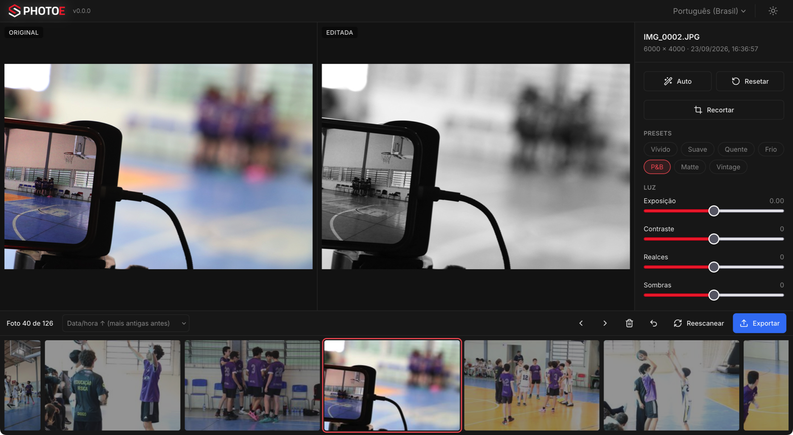
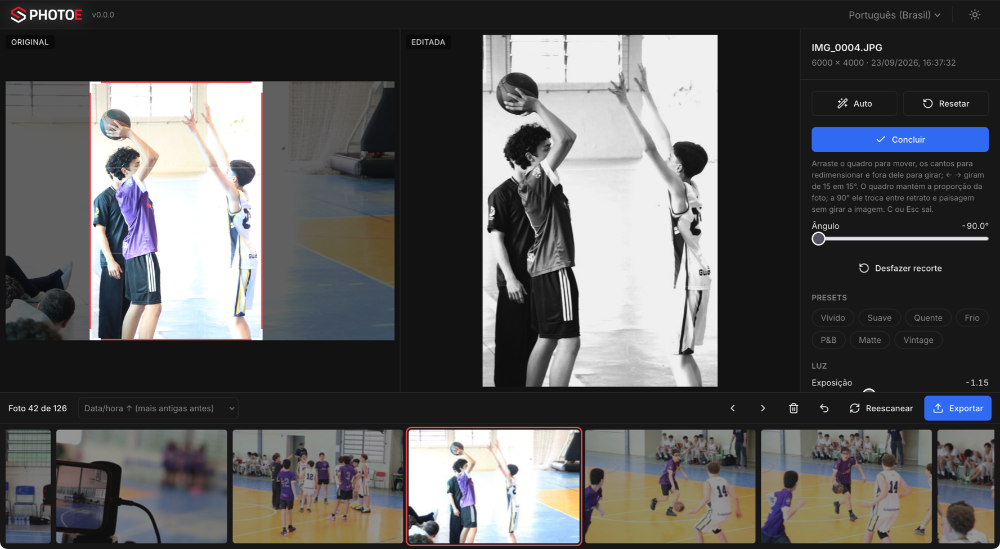
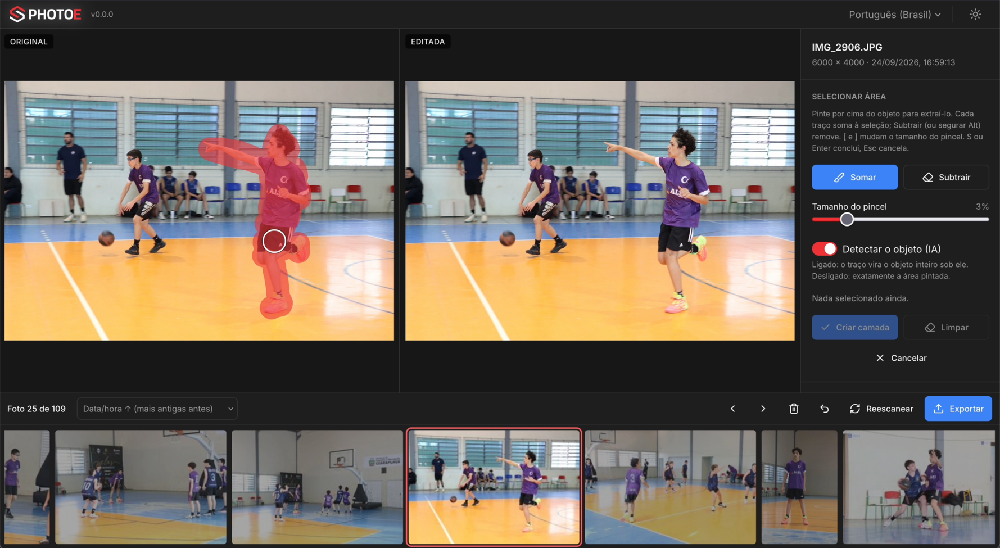
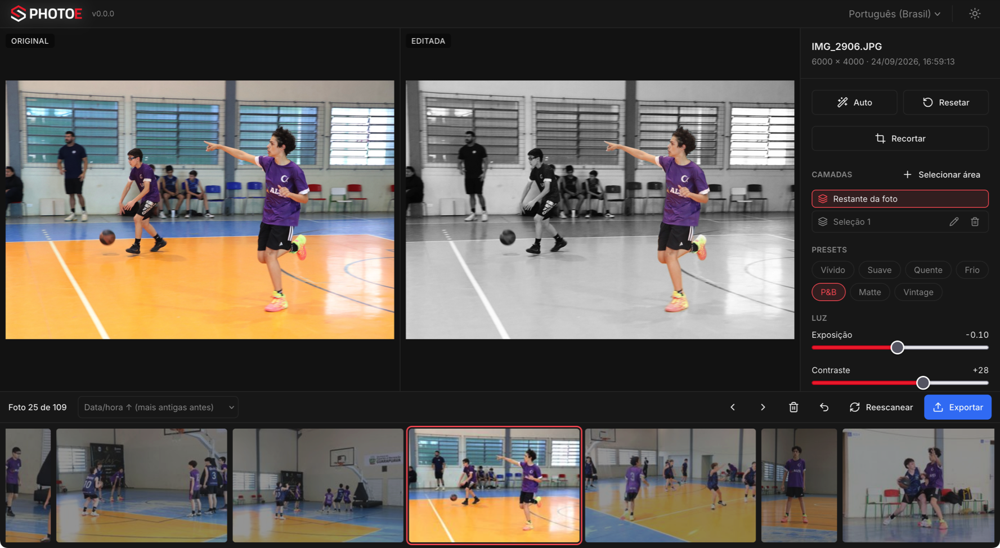

# PhotoEditor

**PhotoEditor é um sistema livre ([BSD 2-Clause](./LICENSE)), feito para
otimizar a seleção e a edição rápida de fotos de eventos.** Em vez de abrir
centenas de arquivos um a um, você percorre o evento inteiro pelo teclado:
descarta as fotos ruins com `DEL`,
aplica `A` (Auto) ou um preset, recorta com `C`, extrai uma pessoa ou objeto
numa camada com `S` e exporta tudo de uma vez, já no formato de publicação. A edição nunca altera os originais.

Foi criado por **Helvio Junior** para agilizar o fluxo das coberturas
fotográficas do [PhotoE](https://photoe.com.br/) — da triagem logo depois do
evento até a pasta pronta para publicar.

Editor no estilo Lightroom (Django REST + React) empacotado como **app desktop
nativo** para Windows, macOS e Linux: Python embarcado + Chromium embarcado
(Qt WebEngine), sem Docker, sem navegador e sem nada instalado na máquina de
quem usa. A janela não tem barra de endereço nem cara de navegador — é o app.

O sistema é **100% público e não autenticado**: não há login, contas, empresas
nem permissionamento. O Django admin também é aberto — quem acessa `/admin/`
entra automaticamente como o usuário padrão `admin`, que não tem senha.

> As convenções obrigatórias do projeto estão em [`CLAUDE.md`](./CLAUDE.md).
> Toda variável, valor padrão e identificador de código é escrito em **inglês**.

## Exemplos

Original e editada lado a lado, painel de edição à direita (Auto, presets e
ajustes de luz e cor) e a filmstrip do evento embaixo:



Modo recorte: o quadro fica sobre a original e a editada mostra o resultado ao
vivo — aqui girado a -90°, trocando paisagem por retrato sem girar a imagem:



## Camadas (seleção de objetos)

`S` entra no modo seleção: pinte por cima de uma pessoa ou objeto na
original e ele vira uma **camada**, com ajustes próprios — o resto da foto
fica em outra, com os dela (ex.: fundo escuro e P&B, jogador em cor). Cada
traço soma à seleção; **Subtrair** (ou `Alt`) remove; `[` e `]` diminuem e
aumentam o pincel. `L` passa de uma camada
para a outra; sliders, presets e Auto editam a camada ativa.

Seleção: o traço do pincel (em vermelho, sobre a original) cobre o jogador e
a IA estende a seleção ao objeto inteiro sob ele:



Resultado: o jogador virou a camada **Seleção 1** e mantém a cor, enquanto o
**Restante da foto** recebeu o preset P&B — o objeto é editado separado do
fundo:



Quem acha o objeto sob o traço é o **SAM 2.1 tiny** (Segment Anything 2, Meta,
Apache-2.0) em ONNX, rodando **localmente em CPU** — não precisa de GPU, de
Ollama nem de internet. O modelo (~155 MB) é baixado no build da imagem do
backend, com revisão e hashes fixos. Custo: ~1,5 s na primeira seleção de
cada foto e ~0,3 s por traço; pico de ~1,2 GB de RAM durante a análise.
Com a opção **Detectar o objeto (IA)** desligada, o pincel seleciona
exatamente a área pintada.

As máscaras ficam em `project_data/masks/` (PNG, nome = hash do conteúdo) e
entram no histórico, no desfazer e na exportação como qualquer ajuste.

## Duplicar (cópia virtual)

O botão **Duplicar** da barra da filmstrip cria uma cópia virtual da foto:
uma entrada nova no catálogo, ao lado da original, que lê o **mesmo JPEG**
(nada é gravado em `raw/`) e tem ajustes, crop e camadas próprios —
começando pelos da foto duplicada. Serve para ter duas versões da mesma foto
(ex.: uma em cor e outra em P&B, ou dois cortes).

O **Exportar** grava a cópia como `publicar/<nome>_copy.jpg` (`_copy2`,
`_copy3`...). Excluir a cópia só a tira do catálogo; excluir a original tira
as cópias da filmstrip junto (desfazer traz tudo de volta). `Ctrl/Cmd+Z`
desfaz a duplicação.

## Capa do evento

A estrela na barra da filmstrip marca a foto atual como **capa** (selo
"Capa" no thumbnail; só uma por projeto — marcar outra tira a anterior; é
desfazível com `Ctrl/Cmd+Z`). No **Exportar** a capa sai duas vezes em
`publicar/`: com o nome original, como toda foto, e como **`capa.jpg`** —
cópia idêntica (se a capa for base de um merge, a cópia é a do merge). Sem
capa, um `capa.jpg` antigo é removido.

## Painéis redimensionáveis

No desktop, as divisões do editor são arrastáveis: fotos × filmstrip,
Original × Editada e a largura do painel de edição. Os tamanhos ficam salvos
no app; duplo clique numa divisória volta ao padrão, e as setas do teclado
também a movem (com ela em foco).

## Merge (trajetória da bola)

Várias fotos da mesma jogada viram uma só, com o objeto de cada clique
empilhado em camadas — a trajetória da bola sobre a cena parada.

1. **Merge** na barra da filmstrip liga a marcação: marque as fotos (a
   primeira, na ordem da faixa, é a **base**) e clique em **Criar merge**.
2. Na tela do merge (`/merges/:id`), pinte com o pincel (`S`, o mesmo das
   camadas, com o SAM) a bola de cada foto. **Só a área pintada** entra no
   resultado. Na base, pinte a bola dela para **esmaecê-la**: o fundo por trás
   vem de uma foto seguinte, onde a bola já saiu dali.
3. Ajuste a **opacidade** de cada camada. **Surgir** (o padrão) deixa a bola
   da base bem clara e cada foto seguinte mais forte, até 100% na última.

Antes de extrair, cada foto é **alinhada à base pelo fundo**: pontos SIFT
filtrados por RANSAC numa transformação de similaridade (deslocamento,
rotação e escala — a câmera na mão anda entre um clique e outro), com a área
selecionada fora da análise. O ganho de exposição/cor também é medido no
fundo. Nas fotos de teste: ~2.100 pontos de fundo por par e erro mediano de
0,2 px no preview.

Nada é gravado em `raw/`. A base passa a representar o merge: no editor, a
**Editada** mostra o merge (ajustes, crop e Auto valem sobre ele) e o
**Exportar** grava `publicar/<base>_merge.jpg`. As fotos das camadas saem da
filmstrip e do Exportar enquanto o merge existir. A lixeira de uma camada
(**Remover do merge**) tira só aquela foto da composição e a devolve à
filmstrip — na última camada, o merge inteiro é desfeito; **Desfazer merge**
devolve todas.

## Stack

| Camada    | Tecnologia                                                        |
|-----------|-------------------------------------------------------------------|
| Janela    | PySide6 6.11 — Qt WebEngine (Chromium) endurecido, sem barra      |
| Backend   | Django 5.2 + Django REST Framework, servido pelo waitress local   |
| Frontend  | React 19 (CRA/craco), TailwindCSS, react-router                   |
| Banco     | SQLite do evento (`<projeto>/project_data`) + `~/.photoe/photoe.db` |
| Runtime   | CPython 3.12 do python-build-standalone, embarcado no pacote      |

Estrutura:

```
backend/    core/ (settings, wsgi) + photoeditor/ (app: models, views, services)
desktop/    shell nativo: janela, menus, navegador endurecido, servidor local
frontend/   src/ (pages, components/ui, contexts, i18n, lib)
tools/      build.py (runtime, modelo, frontend, pacote) + Dockerfile do builder
```

## Arquitetura

```
┌─ shell (desktop/app.py) ─────────────┐        ┌─ servidor (desktop/server.py) ─┐
│ QMainWindow + menus nativos          │ spawn  │ Django + waitress              │
│ QWebEngineView endurecido  ──────────┼──────► │ http://127.0.0.1:<porta>       │
│  • só navega na origem do servidor   │ cookie │ AppTokenMiddleware (token)     │
│  • /__desktop__/<ação> → SO          │ token  │ SQLite do projeto aberto       │
└──────────────────────────────────────┘        └────────────────────────────────┘
```

- **Dois processos, o mesmo Python embarcado.** Trocar de projeto derruba o
  servidor e sobe outro apontando para a nova pasta; sem projeto, ele sobe em
  **modo Home** (só a tela inicial e os projetos recentes). Um crash nativo
  (onnxruntime, OpenCV) derruba o servidor, não a janela.
- **Navegador endurecido** (`desktop/browser.py`): sem barra de endereço,
  abas, menu de contexto ou DevTools; link externo abre no navegador do SO;
  permissões de página (câmera, localização, notificações…) negadas;
  `file:`/`chrome:`/`javascript:` barrados.
- **Servidor só para o app:** escuta em `127.0.0.1`, recusa Host diferente
  (DNS rebinding) e exige o token sorteado a cada execução, entregue ao
  navegador embarcado como cookie `HttpOnly`/`SameSite=Strict`. Um site
  aberto no navegador comum da pessoa não consegue chamar a API.
- **Ponte React → SO:** o React navega para `/__desktop__/<ação>` (abrir
  pasta, novo projeto, voltar ao Início, mostrar no Finder/Explorer) e o
  shell intercepta antes de a navegação sair (`frontend/src/lib/desktop.js`).

## Principais pontos

### 1. Acesso público
- Sem login, contas ou permissões: a API não tem classe de autenticação e
  libera tudo (`REST_FRAMEWORK` em `core/settings.py`). A única trava é a de
  transporte (token do app, acima), que não identifica pessoa nenhuma.
- Django admin público: `photoeditor/middleware.py` (`PublicAdminMiddleware`)
  loga toda visita a `/admin/` como o usuário `admin` (senha inutilizável).
- Estáticos do admin (`/django-static/`) e o build do React saem pelo
  WhiteNoise, direto das apps — sem `collectstatic`.

### 2. Internacionalização (EN + PT-BR)
- **EN é o padrão e o fallback** de toda tradução.
- Frontend: `useI18n()` (`t`/`tf`) + catálogos em `src/i18n/locales.js`.
- Backend: `photoeditor/i18n.py` (`translate`, `tr`, `language_for_request`).
- Shell desktop (menus, diálogos nativos): `desktop/i18n.py`, que acompanha o
  idioma escolhido no app observando o cookie `photoeditor_ln`.

### 3. E-mail e identidade visual
- Template HTML de marca em `photoeditor/templates/email/`, renderizado por
  `services/mailer.py`.
- Logo, favicon e a fonte Inter vão no próprio build — o app funciona offline.
  Cache-busting `?ts=<BUILD_TS>` em todo objeto estático.

### 4. UI/UX (convenções)
- Confirmações/alertas via **modais próprios** (nunca diálogos nativos do browser).
- Telas e formulários ocupam **100%** da largura.
- Detalhe de objeto abre em **janela/rota própria**, não em modal
  (`window.open` vira uma janela do app, igualmente sem barra).

## Tela inicial e projetos

A Home mostra **Abrir projeto**, **Novo projeto** e os projetos recentes em
cards — capa, nº de fotos, tamanho e data da última abertura.

**Novo projeto** conforme a pasta escolhida:

- já é um projeto do editor (tem `project_data/db.sqlite3` ou `raw/`) → abre,
  como o "Abrir projeto";
- tem JPEGs soltos → cria `raw/` e **move** esses JPEGs para ela (só os da
  raiz; subpastas, ocultos e outros arquivos ficam onde estão; nada é
  sobrescrito) e abre;
- vazia → cria `raw/` e oferece copiar fotos de outro lugar.

O **Abrir projeto** numa pasta de JPEGs sem `raw/` oferece o mesmo: mover as
fotos para `raw/` e continuar. A lista mora no banco do app,
`~/.photoe/photoe.db`; remover um card nunca toca na pasta.

Cada evento é uma pasta:

```
<projeto>/
    raw/            fotos originais (somente JPEG, nunca alteradas)
    project_data/   db.sqlite3 + caches gerados + masks/ (camadas)
    deleted/        fotos excluídas (movidas, nunca apagadas)
    publicar/       saída do botão Exportar
```

O app cria `project_data/`, `deleted/` e `publicar/`; `raw/` só é criada
depois de perguntar. Ao abrir o projeto, o servidor roda `migrate` no SQLite
dele. Um projeto só abre em uma janela por vez (trava em `project_data/`).

O que é da máquina, não do evento, fica em `~/.photoe/` (igual nos três SOs):
`photoe.db`, segredos gerados, perfil do navegador (`webengine/`), capas dos
cards e `logs/` (`desktop.log` e `server.log`).

## Compilação: `make`

O **`Makefile` é a base de compilação**: `make` sozinho gera os instaladores
(o mesmo que `make dist`) e `make help` lista os alvos.
Pré-requisitos: `make`, `python3` (qualquer 3.9+) e Docker (para o frontend,
os testes do React e os instaladores). Node não precisa estar instalado.

| Comando | O que faz |
|---|---|
| `make run` | abre o app (baixa runtime e modelo e builda o frontend, se faltar) |
| `make dev` | idem, com DevTools (F12) e menu de contexto |
| `make run ARGS="~/Fotos/evento"` | já abrindo um projeto |
| `make frontend` | build do React em `frontend/build` |
| `make dist` | instaladores de todas as plataformas em `dist/` |
| `make macos` / `make windows` / `make linux` | `.dmg` / `.msi` / `.tar.gz` |
| `make dist TARGETS="macos-arm64 windows-x64"` | só os alvos escolhidos |
| `make test` | `check` do Django, migrations em dia, build e testes do React |
| `make migrations` | gera a migration depois de mudar um modelo |
| `make art` | prévia da arte dos instaladores em `.cache/art` |
| `make bump` | sobe o `VERSION` (antes de cada commit) |
| `make clean` / `make clean-all` | apaga o gerado / também runtimes, downloads e modelo |

O runtime do host fica em `.runtime/<alvo>/` (CPython 3.12 + dependências). Com
hot-reload do React: `yarn start` no `frontend/` e
`make run ARGS="--port 47823 --frontend-url http://127.0.0.1:3000"`.

## Pacotes (builder em Docker)

Um container Linux monta o pacote de **todas** as plataformas — nada é
compilado: o Python de cada alvo é o CPython pronto do python-build-standalone
e as dependências são wheels binárias baixadas com `pip --platform <alvo>`.

```bash
make dist                                   # todos os alvos
make windows                                # só o .msi
make dist TARGETS="macos-arm64 linux-x64"   # alvos escolhidos
```

Saída em `dist/`, um instalador por SO:

| Alvo          | Arquivo                                   | O que é                              |
|---------------|-------------------------------------------|--------------------------------------|
| `macos-arm64` | `PhotoEditor-<versão>-macos-arm64.dmg`    | `PhotoEditor.app` + janela "arraste para Aplicativos" |
| `windows-x64` | `PhotoEditor-<versão>-windows-x64.msi`    | instala em `Program Files`, atalhos no Menu Iniciar e na Área de Trabalho |
| `linux-*`     | `PhotoEditor-<versão>-linux-*.tar.gz`     | pasta com `runtime/`, `app/` e o lançador `PhotoEditor` |

`--keep-dirs` mantém também a pasta aberta do pacote, para testar no lugar.

- **`.dmg`** — montado no Linux como o do Firefox: `mkfs.hfsplus` cria o volume
  HFS+, o `hfsplus` do libdmg-hfsplus o preenche e o `dmg` comprime. A janela
  que o Finder abre ao montar (fundo, tamanho, posição dos ícones) é o
  `.DS_Store` escrito em `tools/packaging/macos.py`; o fundo e os ícones são
  desenhados a partir do logo em `tools/packaging/art.py`
  (`python -m tools.packaging.art <pasta>` gera uma prévia).
- **`.msi`** — gerado pelo `wixl` (msitools). Instala por máquina; o
  `UpgradeCode` fixo faz a versão nova substituir a anterior e recusa
  downgrade. A `ProductVersion` é derivada do `VERSION` (o MSI só aceita
  `255.255.65535`; ver `msi_version`).
- **Sem assinatura, por enquanto:** no macOS o primeiro clique no app é
  bloqueado pelo Gatekeeper (liberar em Ajustes do Sistema → Privacidade e
  Segurança → "Abrir Mesmo Assim"); no Windows o SmartScreen avisa ao abrir
  o `.msi`. Assinar e notarizar exige certificados (Apple Developer ID e um
  code-signing do Windows) — próxima etapa.

**Espaço em disco:** cada alvo ocupa ~1,5 GB de runtime em
`.runtime-builder/` (reaproveitado entre builds) e ~0,5–0,7 GB de pacote. Os
quatro alvos pedem ~15 GB livres — no macOS, também dentro do disco do Docker
Desktop.

| Alvo          | SO mínimo (ditado pelas wheels)                          |
|---------------|----------------------------------------------------------|
| `windows-x64` | Windows 10/11 64 bits                                    |
| `macos-arm64` | macOS 14 (Apple Silicon)                                 |
| `linux-x64`   | glibc 2.34 — Ubuntu 22.04, Debian 12, Fedora 35          |
| `linux-arm64` | glibc 2.39 — Ubuntu 24.04                                |

Instaladores (MSI/NSIS, `.app`/DMG com assinatura, AppImage/deb) são a
próxima etapa e partem destas pastas.

## Banco e migrations

- Modelos em `photoeditor/dbmodels/` (herdam de `dbmodels.base.Base`); o único
  usuário é o `admin` no `auth.User` do Django.
- Migrations incrementais e versionadas (regra 13 do `CLAUDE.md`).

## Principais endpoints (API)

| Método/Rota          | Descrição                                          |
|----------------------|----------------------------------------------------|
| `GET  /api/config/`  | Idioma, marca, versão e o projeto aberto (ou Home) |
| `GET/DELETE /api/projects/recent/` | Projetos recentes da Home / tirar da lista |
| `GET  /api/projects/cover/?path=` | Capa do card (1ª foto de `raw/`)      |
| `GET  /api/develop/` | Sliders, presets e camadas (`smart_select`)        |
| `POST /api/photos/<id>/segment/` | Traço do pincel → máscara do objeto    |
| `GET  /api/masks/<chave>.png` | Máscara de uma camada (overlay)           |
| `POST /api/photos/<id>/duplicate/` | Cópia virtual da foto, com os ajustes dela |
| `POST /api/photos/<id>/cover/` | Marca (`{"cover": true}`) ou desmarca a capa do evento |
| `POST /api/merges/`  | Cria o merge (`{"photos": [...]}`, a 1ª é a base)  |
| `GET/PUT/DELETE /api/merges/<id>/` | Lê, edita (área/opacidade) e desfaz o merge |
| `DELETE /api/merges/<id>/layers/<foto>/` | Tira a foto da composição (volta à filmstrip) |
| `GET  /api/merges/<id>/layers/<foto>.png?mask=` | Área alinhada sobre o preview da base |
| `/admin/`            | Django admin público                               |

## Licença

Distribuído sob a licença **BSD 2-Clause** — veja [`LICENSE`](./LICENSE).
Criado por Helvio Junior para as coberturas do [PhotoE](https://photoe.com.br/).
